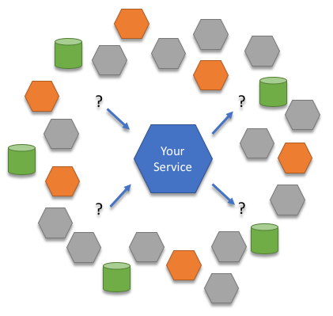
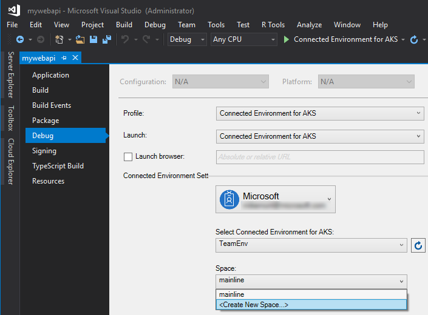
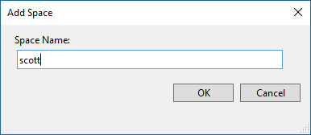
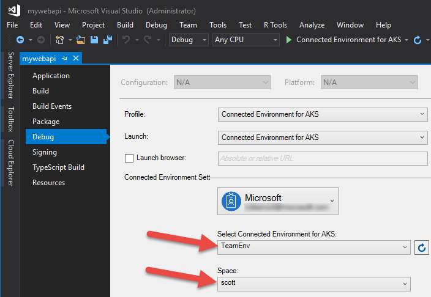

# Get Started on Connected Environment with .NET Core and Visual Studio

Previous step: [Call another container](get-started-netcore-visualstudio-05.md)

## Learn about team development

So far we've run our application's code as if we were the only developer working on the app. In this section, we'll learn how Connected Environment streamlines team development:
* Enable a team of developers to work in the same development environment.
* Supports each developer iterating on their code in isolation and without fear of breaking others.
* Test code end-to-end, prior to code commit, without having to create mocks or simulate dependencies.

## Challenges with developing microservices
Our sample application isn't very complex at the moment. But in real-world development, challenges soon emerge as more services are added and the development team grows.

Picture yourself working on a service that interacts with dozens of other services.

1. It can become unrealistic to run everything locally for development. Your dev machine may not have enough resources to run the entire app. Or, perhaps your app has endpoints that need to be publicly reachable (for example, your app responds to a webhook from a SaaS app).
1. You can try to only run the services that you depend on, but this means you'd need know the full closure of dependencies (for example, dependencies of dependencies). Or, it's a matter of not easily knowing how to build and run your dependencies because you didn't work on them.
1. Some developers resort to simulating, or mocking up, many of their service dependencies. This can help sometimes, but managing those mocks can soon take on its own development effort. Plus, this leads to your dev environment looking very different to production, and subtle bugs can creep in.
1. It follows that doing any type of end-to-end testing becomes difficult. Integration testing can only realistically happen post-commit, which means we see problems later in the development cycle.

    

## Work in a shared development environment
With Connected Environment, you can set up a *shared* development environment in Azure. Each developer can focus on just their part of the application, and can iteratively develop *pre-commit code* in an environment that already contains all the other services and cloud resources that their scenarios depend on. Dependencies are always up to date, and developers are working in a way that mirrors production.

## Work in your own space
As you develop code for your service, and before you're ready to check it in, code often won't be in a good state. You're still iteratively shaping it, testing it, and experimenting with solutions. Connected Environment provides the concept of a **space**, which allows you to work in isolation, and without the fear of breaking your team members.

Do the following to make sure both our `webfrontend` and `mywebapi` services are running in our development environment **and in the `mainline` space**.
1. Close any F5/debug sessions for both services, but keep the projects open in their Visual Studio windows.
2. Switch to the Visual Studio window with the `mywebapi` project and press Ctrl+F5 to run the service without the debugger attached
3. Switch to the Visual Studio window with the `webfrontend` project and press Ctrl+F5 to run it as well.

> [!Note]
It is sometimes necessarry to refresh your browser after it the web page is initially displayed following a Ctrl+F5.

Anyone who opens the public URL and navigates to the web app will invoke the code path we have written which runs through both services using the default `mainline` space. Now suppose we want to continue developing `mywebapi` - how can we do this and not interrupt other developers who are using the development environment? To do that, we'll set up our own space.

### Create a New Space
From within Visual Studio you can create additional spaces which will be used when you F5 or Ctrl+F5 your service. You can call a space anything you'd like, and you can be flexible about what it means (ex. `sprint4` or `demo`).

Do the following to create a new space:
1. Switch to the Visual Studio window with the `mywebapi` project.
2. Right-click on the project in **Solution Explorer** and select **Properties**.
3. Select the **Debug** tab on the left to show the Connected Environment settings.
4. From here you can change or create the Connected Environment and/or space that will be used when you F5 or Ctrl+F5. *Make sure the Connected Environment you created earlier is selected*.
5. In the **Space** dropdown select **<Create New Space…>**.

    

6. In the **Add Space** dialog type in a name for the space and click **OK**. I've used my name ("scott") for the new space so that it is identifiable to my peers what space I'm working in.

    

7. You should now see your development environment and new Space selected on the project properties page.

    

### Update code for *mywebapi*

1. In the `mywebapi` project make a code change to the `string Get(int id)` method in file `ValuesController.cs` as follows:
 
    ```csharp
    [HttpGet("{id}")]
    public string Get(int id)
    {
        return "mywebapi now says something new";
    }
    ```

2. Set a breakpoint in this updated block of code (you may already have one set from before).
3. Hit F5 to start the `mywebapi` service. This will start the service in your development environment using the selected space, which in my case is `scott`.

Here is a diagram that will help you understand how the different spaces work. The blue path shows a request via the `mainline` space, which is the default path used if no space is prepended to the URL. The green path shows a request via the `scott` space.


This built-in capability of Connected Environment enables you to test code end-to-end in a shared evironment without requiring each developer  to re-create the full stack of services in their space. Note that this routing requires propagation headers to be forwarded in your app code, as illustrated in the previous step of this guide.

## Test Code Running in the `scott` Space
To test our new version of `mywebapi` in conjunction with `webfrontend`, open your browser to the public access point URL for `webfrontend` (ex. https://webfrontend-teamenv.vsce.io) and go to the About page. You should see the original message "Hello from webfrontend and Hello from mywebapi".

Now, add the "scott-" part to the URL so it reads something like https://scott-webfrontend-teamenv.vsce.io and refresh the browser. The breakpoint you set in your `mywebapi` project should get hit. Click F5 to proceed and in your browser you should now see the new message "Hello from webfrontend and mywebapi now says something new". This is because the path to your updated code in `mywebapi` is running in the `scott` space.

> [!div class="nextstepaction"]
> [Summary](get-started-netcore-visualstudio-07.md)