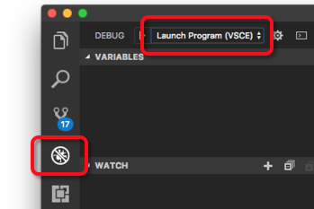

# Get Started on Connected Environment with Node.js

Previous step: [Create a Node.js container in Kubernetes](get-started-nodejs-03.md)

[!INCLUDE[](includes/debug-intro.md)]

[!INCLUDE[](includes/init-debug-assets-vscode.md)]


## Select the VSCE debug configuration
1. To open the Debug view, click on the Debug icon in the **Activity Bar** on the side of VS Code.
1. Select **Launch Program (VSCE)** as the active debug configuration.



> [!Note]
> If you don't see any Connected Environment commands in the Command Palette, ensure you have [installed the VS Code extension for Connected Environment](get-started-nodejs-01.md#get-kubernetes-debugging-for-vs-code).

## Debug the container in Kubernetes
Hit **F5** to debug your code in Kubernetes!

Similar to the `up` command, code is synced to the development environment when you start debugging, and a container is built and deployed to Kubernetes. This time, of course, the debugger is attached to the remote container.

[!INCLUDE[](includes/tip-vscode-status-bar-url.md)]

Set a breakpoint in a server-side code file, for example within the `app.get('/api'...` in  `server.js`. Refresh the browser page, or press the 'Say It Again' button, and you should hit the breakpoint and be able to step through code.

You have full access to debug information just like you would if the code was executing locally, such as the call stack, local variables, exception information, etc.

## Edit code and refresh the debug session
With the debugger active, make a code edit; for example, modify the hello message again:

```javascript
app.get('/api', function (req, res) {
    res.send('**** Hello from webfrontend running in Azure! ****');
});
```

Save the file, and in the **Debug actions pane**, click the **Refresh** button. 


Instead of rebuilding and redeploying a new container image each time code edits are made, which will often take considerable time, Connected Environment will restart the Node.js process in between debug sessions to provide a faster edit/debug loop.

Refresh the web app in the browser, or press the *Say It Again* button. You should see your custom message appear in the UI.


## Use NodeMon to develop even faster
*Nodemon* is a popular tool that Node.js developers use for rapid development. Instead of manually restarting the Node process each time a server-side code edit is made, developers will often configure their Node project to have *nodemon* monitor file changes and automatically restart the server process. In this style of working, the developer just refreshes their browser after making a code edit.

Connected Environment's intent is for you to be able to use the same, productive development workflows you employ when developing locally. To illustrate this, the sample `webfrontend` project was configured to use *nodemon* (it is configured as a dev dependency in `package.json`).

Try the following:
1. Stop the VS Code debugger.
1. Click on the Debug icon in the **Activity Bar** on the side of VS Code. 
1. Select **Attach (VSCE)** as the active debug configuration.
1. Hit F5.

In this configuration, the container is configured to start *nodemon*. When server code edits are made, *nodemon* automatically restarts the Node process, just like it does when you develop locally. 
1. Edit the hello message again in `server.js`, and save the file.
1. Refresh the browser, or click the *Say It Again* button, to see your changes take effect!

**Now you have a method for rapidly iterating on code and debugging directly in Kubernetes!** Next, we'll see how we can create and call a second container.

> [!div class="nextstepaction"]
> [Call a service running in a separate container](get-started-nodejs-05.md)

