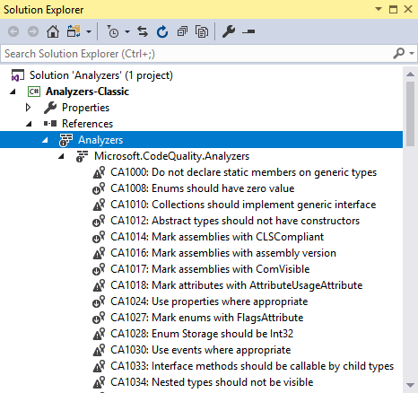
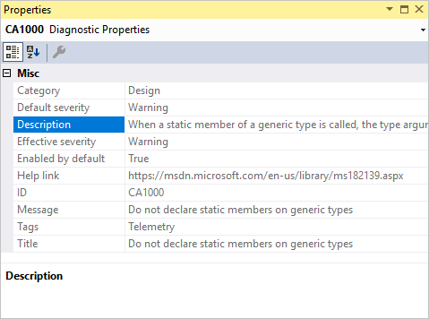
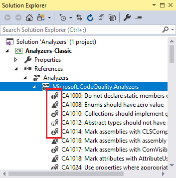
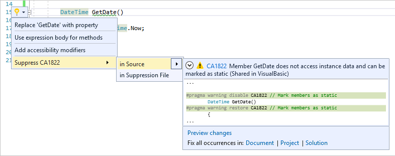
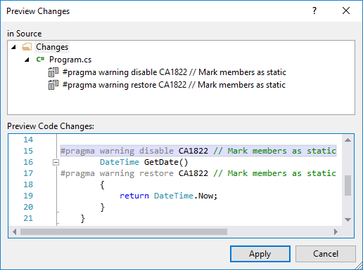
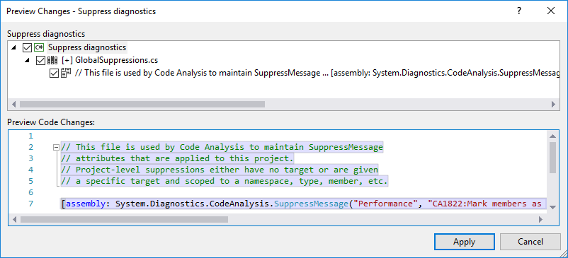

# Use Roslyn analyzers

.NET Compiler Platform ("Roslyn") analyzer rules, or *diagnostics*, analyze your C# or Visual Basic code as you type. Each diagnostic has a default severity and suppression state that can be overwritten for your project. This article covers setting rule severity, using rule sets, and suppressing violations.

## Analyzers in Solution Explorer

You can do much of the customization of analyzer diagnostics from **Solution Explorer**. If you [install analyzers](../code-quality/install-roslyn-analyzers.md) as a NuGet package, an **Analyzers** node appears under the **References** or **Dependencies** node in **Solution Explorer**. If you expand **Analyzers**, and then expand one of the analyzer assemblies, you see all the diagnostics in the assembly.



You can view the properties of a diagnostic, including its description and default severity, in the **Properties** window. To view the properties, right-click on the rule and select **Properties**, or select the rule and then press **Alt**+**Enter**.



To see online documentation for a diagnostic, right-click on the diagnostic and select **View Help**.

The icons next to each diagnostic in **Solution Explorer** correspond to the icons you see in the rule set when you open it in the editor:

- the "i" in a circle indicates a [severity](#rule-severity) of **Info**
- the "!" in a triangle indicates a [severity](#rule-severity) of **Warning**
- the "x" in a circle indicates a [severity](#rule-severity) of **Error**
- the "i" in a circle on a light-colored background indicates a [severity](#rule-severity) of **Hidden**
- the downward-pointing arrow in a circle indicates that the diagnostic is suppressed



## Rule sets

A [rule set](../code-quality/using-rule-sets-to-group-code-analysis-rules.md) is an XML file that stores the severity and suppression state for individual diagnostics. Rule sets apply to a single project, and a project can have multiple rule sets. To view the active rule set in the editor, right-click on the **Analyzers** node in **Solution Explorer** and select **Open Active Rule Set**. If this is the first time you are accessing the rule set, a file named *\<projectname>.ruleset* is added to the project and appears in **Solution Explorer**.

> [!NOTE]
> Rule sets include both static (binary) code analysis and Roslyn analyzer rules.

You can change the active rule set for a project on the **Code Analysis** tab of a project's properties. Select the rule set in the **Run this rule set** drop-down list. You can also open the rule set from the **Code Analysis** property page by selecting **Open**.

## Rule severity

You can configure the severity of analyzer rules, or *diagnostics*, if you [install the analyzers](../code-quality/install-roslyn-analyzers.md) as a NuGet package. The following table shows the severity options for diagnostics:

|Severity|Build-time behavior|Editor behavior|
|-|-|-|
|Error|Violations appear as *Errors* in the **Error List** and in command-line build output, and cause builds to fail.|Offending code is underlined with a red squiggly, and marked by a small red box in the scroll bar.|
|Warning|Violations appear as *Warnings* in the **Error List** and in command-line build output, but do not cause builds to fail.|Offending code is underlined with a green squiggly, and marked by a small green box in the scroll bar.|
|Info|Violations appear as *Messages* in the **Error List**, and not at all in command-line build output.|Offending code is underlined with a gray squiggly, and marked by a small gray box in the scroll bar.|
|Hidden|Non-visible to user.|Non-visible to user. The diagnostic is reported to the IDE diagnostic engine, however.|
|None|Suppressed completely.|Suppressed completely.|

In addition, you can "reset" a rule's severity by setting it to **Default**. Each diagnostic has a default severity that can be seen in the **Properties** window.

The following screenshot shows three different diagnostic violations in the code editor, with three different severities. Notice the color of the squiggly, as well as the small box in the scroll bar on the right.


The following screenshot shows the same three violations as they appear in the **Error List**:


You can change the severity of a rule from **Solution Explorer**, or within the *\<projectname>.ruleset* file that is added to the solution after you change the severity of a rule in **Solution Explorer**.


### To set rule severity from Solution Explorer

1. In **Solution Explorer**, expand **References** > **Analyzers** (**Dependencies** > **Analyzers** for .NET Core projects).

1. Expand the assembly that contains the rule you want to set severity for.

1. Right-click on the rule and select **Set Rule Set Severity**. In the fly-out menu, select one of the severity options.

   The severity for the rule is saved in the active rule set file.

### To set rule severity in the rule set file

1. Open the [rule set](analyzer-rule-sets.md) file by double-clicking it in **Solution Explorer**, selecting **Open Active Rule Set** on the right-click menu of the **Analyzers** node, or by selecting **Open** on the **Code Analysis** property page for the project.

1. Browse to the rule by expanding its containing assembly.

1. In the **Action** column, select the value to open a drop-down list, and select the desired severity from the list.

   

## Suppress violations

There are multiple ways to suppress rule violations:

- To suppress all current violations, select **Analyze** > **Run Code Analysis and Suppress Active Issues** on the menu bar. This is sometimes referred to as "baselining".

- To suppress a diagnostic from **Solution Explorer**, set its severity to **None**.

- To suppress a diagnostic from the rule set editor, uncheck the box next to its name, or set **Action** to **None**.

- To suppress a diagnostic from the code editor, place the cursor in the line of code with the violation and press **Ctrl**+**.** to open the **Quick Actions** menu. Select **Suppress CAxxxx** > **In Source** or **Suppress CAxxxx** > **In Suppression File**.

   

- To suppress a diagnostic from the **Error List**, see [Suppress violations from the Error List](#suppress-violations-from-the-error-list).

### Suppress violations from the Error List

You can suppress one or many diagnostics from the **Error List** by selecting the ones you want to suppress, and then right-clicking and selecting **Suppress** > **In Source** or **Suppress** > **In Suppression File**.

- If you select **In Source**, the **Preview Changes** dialog opens and shows a preview of the C# [#pragma warning](/dotnet/csharp/language-reference/preprocessor-directives/preprocessor-pragma-warning) or Visual Basic [#Disable warning](/dotnet/visual-basic/language-reference/directives/directives) directive that's added to the source code.

   

- If you select **In Suppression File**, the **Preview Changes** dialog opens and shows a preview of the <xref:System.Diagnostics.CodeAnalysis.SuppressMessageAttribute> attribute that's added to the global suppressions file.

   

In the **Preview Changes** dialog, select **Apply**.

The **Error List** displays diagnostics, or rule violations, from both live code analysis and build. Since the build diagnostics can be stale, for example, if you've edited the code to fix the violation but haven't rebuilt, you cannot suppress these diagnostics from the **Error List**. However, diagnostics from live analysis, or IntelliSense, are always up-to-date with current sources, and can be suppressed from the **Error List**. If the suppression option is disabled in the right-click, or context, menu, it's likely because you have one or more build diagnostics in your selection. To exclude the build diagnostics from your selection, switch the **Error List** source filter from **Build + IntelliSense** to **Intellisense Only**. Then, select the diagnostics you want to suppress and proceed as described previously.


> [!NOTE]
> In a .NET Core project, if you add a reference to a project that has NuGet analyzers, those analyzers are automatically added to the dependent project too. To disable this behavior, for example if the dependent project is a unit test project, mark the NuGet package as private in the *.csproj* or *.vbproj* file of the referenced project:
>
> ```xml
> <PackageReference Include="Microsoft.CodeAnalysis.FxCopAnalyzers" Version="2.6.0" PrivateAssets="all" />
> ```

## Command-line usage

When you build your project at the command line, rule violations appear in the build output if the following conditions are met:

- The analyzers are installed as a Nuget package and not as a VSIX extension.

- One or more rules are violated in the project's code.

- The [severity](#rule-severity) of a violated rule is set to either **warning**, in which case violations don't cause build to fail, or **error**, in which case violations cause build to fail.

The verbosity of the build output does not affect whether rule violations are shown. Even with **quiet** verbosity, rule violations appear in the build output.

> [!TIP]
> If you're accustomed to running static code analysis from the command line, either with *FxCopCmd.exe* or through msbuild with the **RunCodeAnalysis** flag, here's how to do that with Roslyn analyzers.

To see analyzer violations at the command line when you build your project using msbuild, run a command like this:

```cmd
msbuild myproject.csproj /target:rebuild /verbosity:minimal
```

The following image shows the command-line build output from building a project that contains an analyzer rule violation:


## See also

- [Overview of Roslyn analyzers in Visual Studio](../code-quality/roslyn-analyzers-overview.md)
- [Submit a Roslyn analyzer bug](https://github.com/dotnet/roslyn-analyzers/issues)
- [Use rule sets](../code-quality/using-rule-sets-to-group-code-analysis-rules.md)
- [Suppress code analysis warnings](../code-quality/in-source-suppression-overview.md)