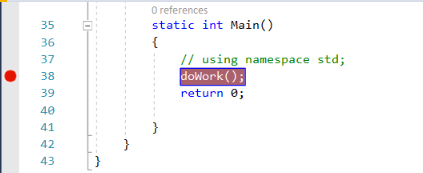
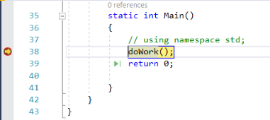
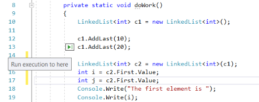
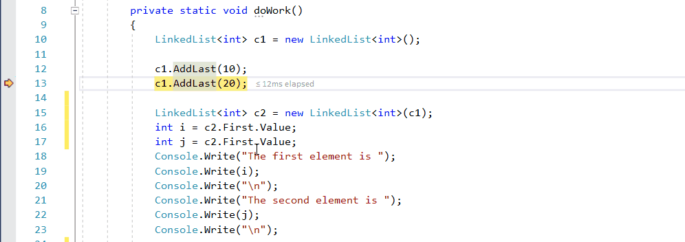

# Quickstart: Debug with C# or Visual Basic using the Visual Studio debugger

The Visual Studio debugger provides many powerful features to help you debug your apps. This topic provides a quick way to learn some of the basic features.

## Create a new project

1. Open Visual Studio and create a new project.

    ::: moniker range=">=vs-2019"
    Press **Esc** to close the start window. Type **Ctrl + Q** to open the search box, type **console**, choose **Templates**, then choose **Create new Console App (.NET Core) project**. In the dialog box that appears, choose **Create**.
    ::: moniker-end
    ::: moniker range="vs-2017"
    From the top menu bar, choose **File** > **New** > **Project**. In the left pane of the **New project** dialog box, under **Visual C#**, choose **.NET Core**, and then in the middle pane choose **Console App (.NET Core)**. Then, type a name like **MyDbgApp** and click **OK**.
    ::: moniker-end

     If you don't see the **Console App (.NET Core)** project template, go to **Tools** > **Get Tools and Features...**, which opens the Visual Studio Installer. Choose the **.NET desktop development** and **.NET Core** workload, then choose **Modify**.

    Visual Studio creates the project.

1. In *Program.cs* or *Module1.vb*, replace the following code

    ```csharp
    class Program
    {
        static void Main(string[] args)
        {
        }
    }
    ```

    ```vb
    Module Module1
        Sub Main()
        End Sub
    End Module
    ```

    with this code:

    ```csharp
    class Program
    {
        private static void doWork()
        {
            LinkedList<int> c1 = new LinkedList<int>();

            c1.AddLast(10);
            c1.AddLast(20);

            LinkedList<int> c2 = new LinkedList<int>(c1);
            int i = c2.First.Value;
            int j = c2.First.Value;
            Console.Write("The first element is ");
            Console.Write(i);
            Console.Write("\n");
            Console.Write("The second element is ");
            Console.Write(j);
            Console.Write("\n");

        }

        static int Main()
        {
            // using namespace std;
            doWork();
            return 0;

        }
    }
    ```

    ```vb
    Imports System.Collections.Generic

    Namespace MyDbgApp
        Class Program
            Private Shared Sub doWork()
                Dim c1 As New LinkedList(Of Integer)()

                c1.AddLast(10)
                c1.AddLast(20)

                Dim c2 As New LinkedList(Of Integer)(c1)
                Dim i As Integer = c2.First.Value
                Dim j As Integer = c2.First.Value
                Console.Write("The first element is ")
                Console.Write(i)
                Console.Write(vbLf)
                Console.Write("The second element is ")
                Console.Write(j)
                Console.Write(vbLf)

            End Sub

            Public Shared Function Main() As Integer
                ' using namespace std;
                doWork()
                Return 0

            End Function
        End Class
    End Namespace
    ```

    > [!NOTE]
    > In Visual Basic, make sure the startup object is set to `Sub Main` (**Properties > Application > Startup Object**).

## Set a breakpoint

A *breakpoint* is a marker that indicates where Visual Studio should suspend your running code so you can take a look at the values of variables, or the behavior of memory, or whether or not a branch of code is getting run. It is the most basic feature in debugging.

1. To set the breakpoint, click in the gutter to the left of the `doWork` function call (or select the line of code and press **F9**).

    

2. Now press **F5** (or choose **Debug > Start Debugging**).

    

    The debugger pauses where you set the breakpoint. The statement where the debugger and app execution is paused is indicated by the yellow arrow. The line with the `doWork` function call hasn't yet executed.

    > [!TIP]
    > If you have a breakpoint in a loop or recursion, or if you have many breakpoints that you frequently step through, use a [conditional breakpoint](../debugger/using-breakpoints.md#BKMK_Specify_a_breakpoint_condition_using_a_code_expression) to make sure that your code is suspended ONLY when specific conditions are met. A conditional breakpoint can save time and it can also make it easier to debug issues that are hard to reproduce.

## Navigate code

There are different commands to instruct the debugger to continue. We show a useful code navigation command that is available starting in Visual Studio 2017.

While paused at the breakpoint, hover over the statement `c1.AddLast(20)` until the green **Run to click** button  appears, and then press the **Run to click** button.



The app continues execution, calling `doWork`, and pauses on the line of code where you clicked the button.

Common keyboard commands used to step through code include **F10** and **F11**. For more in-depth instructions, see [First look at the debugger](../debugger/debugger-feature-tour.md).

## Inspect variables in a datatip

1. In the current line of code (marked by the yellow execution pointer), hover over the `c1` object with your mouse to show a datatip.

    

    The datatip shows you the current value of the `c1` variable and allows you to inspect its properties. When debugging, if you see a value you don't expect, you probably have a bug in the preceding or calling lines of code.

2. Expand the datatip to look at the current property values of the `c1` object.

3. If you want to pin the datatip so that you can continue to see the value of `c1` while you execute code, click the small pin icon. (You can move the pinned datatip to a convenient location.)

## Edit code and continue debugging

If you identify a change that you want to test in your code while in the middle of a debugging session, you can do that, too.

1. Click the second instance of `c2.First.Value` and change `c2.First.Value` to `c2.Last.Value`.

2. Press **F10** (or **Debug > Step Over**) a few times to advance the debugger and execute the edited code.

    

    **F10** advances the debugger one statement at a time, but steps over functions instead of stepping into them (the code that you skip still executes).

For more information on using edit-and-continue and on feature limitations, see [Edit and Continue](../debugger/edit-and-continue.md).

## Next steps

In this tutorial, you've learned how to start the debugger, step through code, and inspect variables. You may want to get a high-level look at debugger features along with links to more information.

> [!div class="nextstepaction"]
> [First look at the debugger](../debugger/debugger-feature-tour.md)
