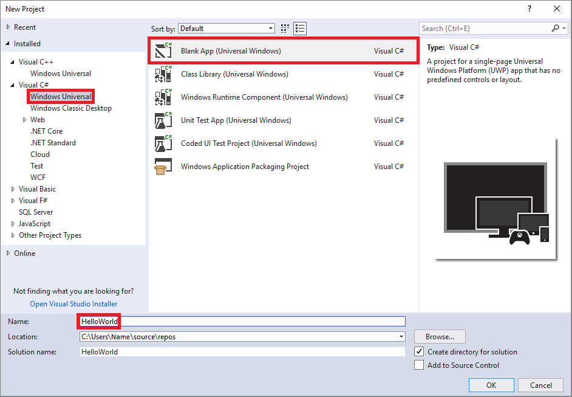
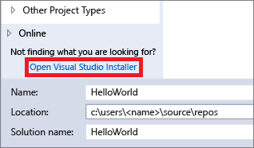
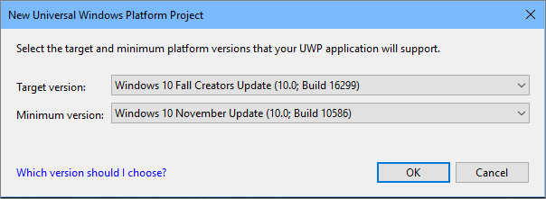
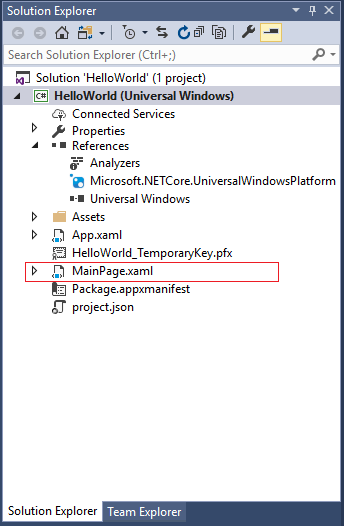
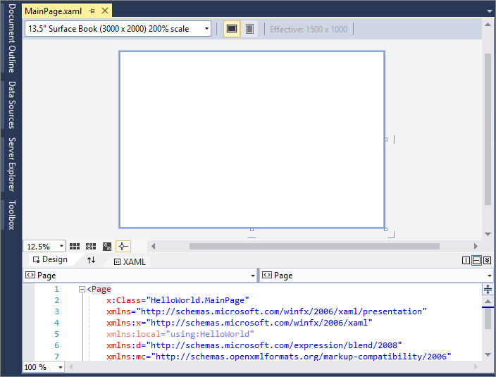
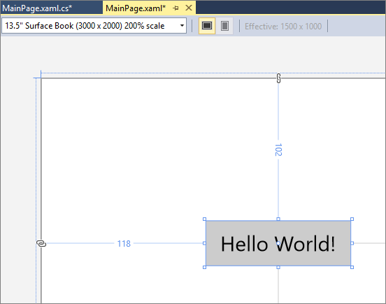
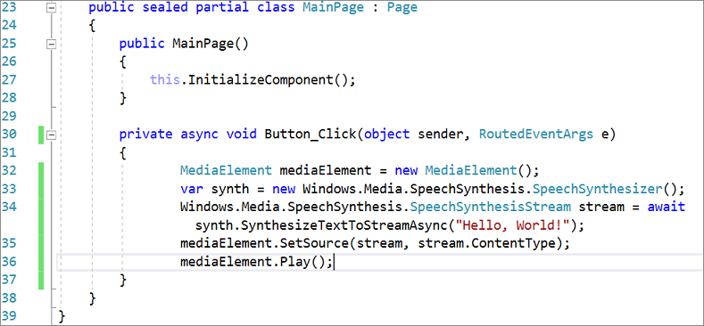
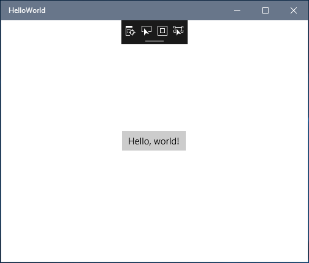

# Tutorial: Create your first Universal Windows Platform application in Visual Studio with XAML and C&#35;

In this introduction to the Visual Studio integrated development environment (IDE), you'll create a "Hello World" app that runs on any Windows 10 device. To do so, you'll use a Universal Windows Platform (UWP) project template, Extensible Application Markup Language (XAML), and the C# programming language.

::: moniker range="vs-2017"
If you haven't already installed Visual Studio, go to the [Visual Studio downloads](https://visualstudio.microsoft.com/vs/older-downloads/?utm_medium=microsoft&utm_source=docs.microsoft.com&utm_campaign=vs+2017+download) page to install it for free.
::: moniker-end
::: moniker range="vs-2019"
If you haven't already installed Visual Studio, go to the [Visual Studio downloads](https://visualstudio.microsoft.com/downloads/?utm_medium=microsoft&utm_source=docs.microsoft.com&utm_campaign=inline+link&utm_content=download+vs2019) page to install it for free.
::: moniker-end

## Create a project

First, create a Universal Windows Platform project. The project type comes with all the template files you need, before you've even added anything!

::: moniker range="vs-2017"
1. Open Visual Studio.

1. From the top menu bar, choose **File** > **New** > **Project**.

1. In the left pane of the **New Project** dialog box, expand **Visual C#**, and then choose **Windows Universal**. In the middle pane, choose **Blank App (Universal Windows)**. Then, name the project *HelloWorld* and choose **OK**.

   

   > [!NOTE]
   > If you don't see the **Blank App (Universal Windows)** project template, click the **Open Visual Studio Installer** link in the left pane of the **New Project** dialog box.<br><br><br><br>The Visual Studio Installer launches. Choose the **Universal Windows Platform development** workload, and then choose **Modify**.<br><br>

1. Accept the default **Target version** and **Minimum version** settings in the **New Universal Windows Platform Project** dialog box.

   
::: moniker-end

::: moniker range=">=vs-2019"
1. Open Visual Studio, and on the start window, choose **Create a new project**.

1. On the **Create a new project** screen, enter *Universal Windows* in the search box, choose the C# template for **Blank App (Universal Windows)**, and then choose **Next**.

   

   > [!NOTE]
   > If you don't see the **Blank App (Universal Windows)** project template, click the **Install more tools and features** link.<br><br><br><br>The Visual Studio Installer launches. Choose the **Universal Windows Platform development** workload, and then choose **Modify**.<br><br>

1. Accept the default **Target version** and **Minimum version** settings in the **New Universal Windows Platform Project** dialog box.

   
::: moniker-end

   > [!NOTE]
   > If this is the first time you have used Visual Studio to create a UWP app, a **Settings** dialog box might appear. Choose **Developer mode**, and then choose **Yes**.<br><br>
   > <br><br>Visual Studio installs an additional Developer Mode package for you. When the package installation is complete, close the **Settings** dialog box.

## Create the application

It's time to start developing. You'll add a button control, add an action to the button, and then start the "Hello World" app to see what it looks like.

### Add a button to the Design canvas

1. In the **Solution Explorer**, double-click *MainPage.xaml* to open a split view.

   ::: moniker range="vs-2017"
   
   ::: moniker-end
   ::: moniker range=">=vs-2019"
   
   ::: moniker-end

   There are two panes: The **XAML Designer**, which includes a design canvas, and the **XAML Editor**, where you can add or change code.

   

1. Choose **Toolbox** to open the Toolbox fly-out window.

   

   (If you don't see the **Toolbox** option, you can open it from the menu bar. To do so, choose **View** > **Toolbar**. Or, press **Ctrl**+**Alt**+**X**.)

1. Click the **Pin** icon to dock the Toolbox window.

   

1. Click the **Button** control and then drag it onto the design canvas.

   

   If you look at the code in the **XAML Editor**, you'll see that the Button has been added there, too:

   

### Add a label to the button

1. In the **XAML Editor**, change Button Content value from "Button" to "Hello World!"

   

1. Notice that the button in the **XAML Designer** changes, too.

   

### Add an event handler

An "event handler" sounds complicated, but it's just another name for code that is called when an event happens. In this case, it adds an action to the "Hello World!" button.

1. Double-click the button control on the design canvas.

1. Edit the event handler code in *MainPage.xaml.cs*, the code-behind page.

   Here is where things get interesting. The default event handler looks like this:

   

   Let's change it, so it looks like this:

   

   Here's the code to copy and paste:

   ```C#
   private async void Button_Click(object sender, RoutedEventArgs e)
         {
             MediaElement mediaElement = new MediaElement();
             var synth = new Windows.Media.SpeechSynthesis.SpeechSynthesizer();
             Windows.Media.SpeechSynthesis.SpeechSynthesisStream stream = await synth.SynthesizeTextToStreamAsync("Hello, World!");
             mediaElement.SetSource(stream, stream.ContentType);
             mediaElement.Play();
         }
   ```

#### What did we just do?

The code uses some Windows APIs to create a speech synthesis object and then gives it some text to say. (For more information on using `SpeechSynthesis`, see  <xref:System.Speech.Synthesis>.)

## Run the application

It's time to build, deploy, and launch the "Hello World" UWP app to see what it looks and sounds like. Here's how.

1. Use the Play button (it has the text **Local Machine**) to start the application on the local machine.

   

   (Alternatively, you can choose **Debug** > **Start Debugging** from the menu bar or press F5 to start your app.)

1. View your app, which appears soon after a splash screen disappears. The app should look similar to this:

   

1. Click the **Hello World** button.

   Your Windows 10 device will literally say, "Hello, World!"

1. To close the app, click the **Stop Debugging** button in the toolbar. (Alternatively, choose **Debug** > **Stop debugging** from the menu bar, or press Shift+F5.)

## Next steps

Congratulations on completing this tutorial! We hope you learned some basics about UWP and the Visual Studio IDE. To learn more, continue with the following tutorial:

> [!div class="nextstepaction"]
> [Create a user interface](/windows/uwp/design/basics/xaml-basics-ui)