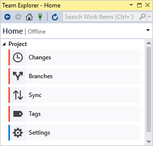
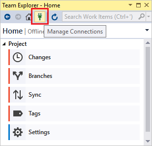
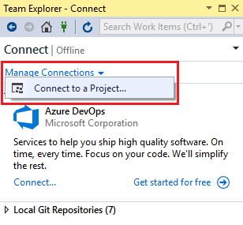

# Connect to projects in Team Explorer

Use the **Team Explorer** tool window to coordinate your code efforts with other team members to develop a project, and to manage work that's assigned to you, your team, or your projects. **Team Explorer** connects Visual Studio to Git and GitHub repositories, Team Foundation version control (TFVC) repositories, and projects hosted on [Azure DevOps Services](/azure/devops/user-guide/what-is-azure-devops-services) or an on-premises [Azure DevOps Server](/tfs/index) (formerly known as TFS). You can manage source code, work items, and builds.

> [!TIP]
> If you open Visual Studio and **Team Explorer** doesn't appear, open it by choosing **View** > **Team Explorer** from the menu bar.

## Connect to a project or repository

Connect to a project or repository on the **Connect** page.

To connect to a project:

1. Open the **Connect** page by choosing the **Manage Connections** icon.

   

1. On the **Connect** page, choose **Manage Connections** > **Connect to a project**.

   

> [!TIP]
> If you need to create a new project or add users to a project, see [Create a project (Azure DevOps)](/azure/devops/organizations/projects/create-project) and [Add users to a project or team (Azure DevOps)](/azure/devops/organizations/security/add-users-team-project).

## See also

- [Team Explorer reference](reference/team-explorer-reference.md)
- [Connect to a project (Azure DevOps)](/azure/devops/organizations/projects/connect-to-projects)