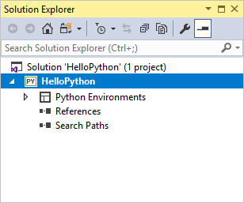
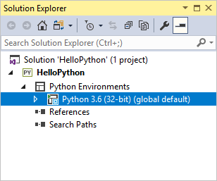
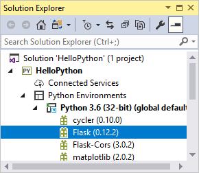

# Quickstart: use Visual Studio to create your first Python web app

In this 5-10 minute introduction to the Visual Studio integrated development environment (IDE), you create a simple Python web application. If you haven't already installed Visual Studio, install it for free [here](http://www.visualstudio.com).

## Create the project

1. Open Visual Studio 2017.

1. From the top menu bar, choose **File > New > Project...**.

1. In the **New Project** dialog box, in the left pane, expand **Installed**, then select **Python**.

1. In the middle pane, choose **Web project**, give the project a name like "HelloPython", then choose **OK**.

    

    If you don't see the Python project templates, cancel out of the **New Project** dialog box and from the top menu bar, choose **Tools > Get Tools and Features...** to open the Visual Studio Installer. Choose the **Python development** workload, then choose **Modify**.

    

1. The new project opens in **Solution Explorer** in the right pane. The project is empty at this point because it contains no other files.

    

**Question What's the advantage of creating a project in Visual Studio for a Python application?**

Answer: Python applications are typically defined using only folders and files, but this structure can become complex as applications become larger and perhaps involve auto-generated files, JavaScript for web applications, and so on. A Visual Studio project helps manage this complexity. The project (a `.pyproj` file) identifies all the source and content files associated with your project, contains build information for each file, maintains the information to integrate with source-control systems, and helps you organize your application into logical components.

## Install the Falcon library

Web apps in Python almost always use one of the many available Python libraries to handle low-level details like routing web requests and shaping responses. For this purpose, Visual Studio provides a variety of templates for web apps using the Bottle, Flask, and Django frameworks.

In this Quickstart, however, you use the Falcon library to experience the process of installing a package and creating the web app from scratch. (Visual Studio does not at present include Falcon-specific templates.) For simplicity, the following steps install Falcon into the default global environment.

1. Expand the **Python Environments** node in the project to see the default environment for the project.

    

1. Right-click the environment and select **Install Python Package...**. This command opens the **Python Environments** window on the **Packages** tab. Enter "falcon" in the search field and select **"pip install falcon" from PyPI**. Accept any prompts for administrator privileges and observe the **Output** window in Visual Studio for progress. (A prompt for elevation happens when the packages folder for the global environment is located within a protected area like `c:\program files`.)

    

1. Once installed, the library appears in the environment in **Solution Explorer**, which means that you can make use of it in Python code.

    

For more information about Falcon, visit [falconframework.org](https://falconframework.org/).

Note that instead of installing libraries in the global environment, developers typically create a "virtual environment" in which to install libraries for a specific project. Many Python project templates in Visual Studio include a `requirements.txt` file that lists the libraries on which the template depends. Creating a project from one of those templates triggers creation of a virtual environment into which the libraries are installed. For more information, see [Python environments - Virtual environments](../python/managing-python-environments-in-visual-studio.md#creating-virtual-environments).

## Add a code file

You're now ready to add a bit of Python code to implement a minimal web app.

1. Right-click the project in **Solution Explorer** and select **Add > New Item...**.

1. In the dialog that appears, select **Empty Python File**, name it `hello.py`, and select **Add**. Visual Studio automatically opens the file in an editor window. (In general, the **Add > New Item...** command is a great way to add different kinds of files to a project, as the item templates often provide useful boilerplate code.)

1. Copy the following code and paste it into `hello.py`:

    ```python
    import falcon

    # In Falcon, define a class for each resource and define on_* methods
    # where * is any standard HTTP methods in lowercase, such as on_get.

    class HelloResource:
        # In this application, the single HelloResource responds to only GET
        # requests, so it has only an on_get method.

        def on_get(self, req, resp):
            resp.status = falcon.HTTP_200  # 200 is the default
            resp.body = "Hello, Python!"

    # Resources are represented by long-lived class instances
    hello = HelloResource()

    # Instruct Falcon to route / and /hello to HelloResource. If you add
    # other resources, use api.add_route to define the desired
    # resource locators for them.
    api = falcon.API()
    api.add_route('/', hello)
    api.add_route('/hello', hello)

    if __name__ == "__main__":
        # Use Python's built-in WSGI reference implementation to run
        # a web server for the application.
        from wsgiref.simple_server import make_server

        # Run the web server on localhost:8080
        print("Starting web app server")
        srv = make_server('localhost', 8080, api)
        srv.serve_forever()
    ```

1. After pasting this code, Visual Studio may show a squiggle underneath `falcon` in the first line and also underneath `wsgiref.simple.server` on line 20. These indicators appear when Visual Studio is still building the IntelliSense database for those modules.

For more information about Falcon, see the [Falcon Quickstart](https://falcon.readthedocs.io/en/stable/user/quickstart.html) (falcon.readthedocs.io).

## Run the application

1. Right-click `hello.py` in **Solution Explorer** and select **Set as startup file**. The command identifies the code file to launch in Python when running the app.

    

1. Right-click the "Hello Python" project in **Solution Explorer** and select **Properties**. Then select the **Debug** tab and set the **Port Number** property to `8080`. This step ensures that Visual Studio launches a browser with `localhost:8080` rather than using a random port.

1. Select **Debug > Start Without Debugging** (Ctrl+F5) to save changes to files and run the app.

1. A command window appears with the message "Starting web app server", then a browser window should open to `localhost:8080` where you see the message, "Hello, Python!" The GET request also appear in the command window.

    If a browser does not open automatically, start the browser of your choice and navigate to `localhost:8080`.)

    If you see only the Python interactive shell in the command window, or if that window flashes on the screen briefly, ensure that you set `hello.py` as the startup file in step 1 above.

1. Close the command window to stop the app, then close the browser window.

## Next steps

Congratulations on completing this Quickstart, in which you've learned a little about the Visual Studio IDE with Python. To continue with a fuller tutorial on Python in Visual Studio, including using the interactive window, debugging, data visualization, and working with Git, select the button below.

> [!div class="nextstepaction"]
> [Tutorial: Getting Started with Python in Visual Studio](../python/tutorial-working-with-python-in-visual-studio-step-01-create-project.md).

- Learn about [Python web app templates in Visual Studio](../python/python-web-application-project-templates.md)
- Learn about [Python debugging](../python/debugging-python-in-visual-studio.md)
- Learn more about the [Visual Studio IDE](../ide/visual-studio-ide.md)
