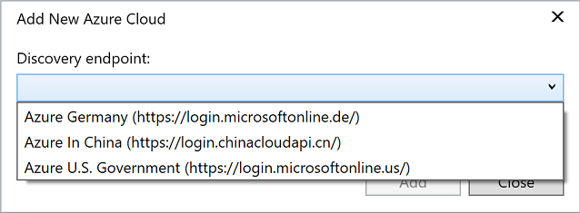

# Accounts, Environment, Options dialog box

Use this page to set various options related to the accounts you use to sign in to Visual Studio.

## Personalization account

### Synchronize settings across devices

Use this option to specify whether to synchronize your settings across multiple machines. For more information, see [Synchronized settings](../../ide/synchronized-settings-in-visual-studio.md).

### Enable device code flow

When this option is selected, the behavior of Visual Studio changes when you select **Add an account** on the **File** > **Account Settings** page. Instead of seeing the **Sign in to your account** page, you're presented with a dialog box that gives you a URL and a code to paste into a web browser to sign in. This option is useful in cases where you can't sign in to Visual Studio in the regular manner, for example, if you use an older version of Internet Explorer, or if your firewall restricts access. For more information, see [Work with multiple user accounts](../work-with-multiple-user-accounts.md#add-an-account-using-device-code-flow).

## Registered Azure clouds

This section shows the Azure cloud instances that you have access to through one or more of the accounts you use to sign in to Visual Studio. For example, you might have access to a private instance of Azure in your company's data center. Or, you might have access to a sovereign or government instance of Azure such as Azure in China or Azure U.S. Government. The global Azure cloud instance appears by default in the list, and you cannot remove it.

Register an additional Azure cloud by choosing the **Add** button. The **Add New Azure Cloud** dialog lists several well-known Azure cloud instances you can connect to, or you can enter the URL to a private Azure endpoint.

After you register an additional Azure cloud, you can choose which Azure cloud you want to sign into when you sign into Visual Studio.

## See also

- [Synchronize settings across multiple computers](../synchronized-settings-in-visual-studio.md)
- [Sign in to Visual Studio](../signing-in-to-visual-studio.md)
- [Work with multiple user accounts](../work-with-multiple-user-accounts.md)
- [Environment settings](../environment-settings.md)
- [Environment Options dialog box](../../ide/reference/environment-options-dialog-box.md)