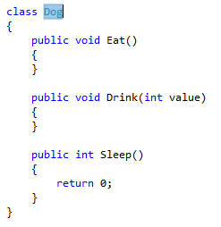
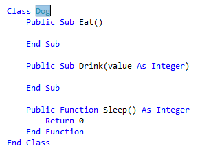
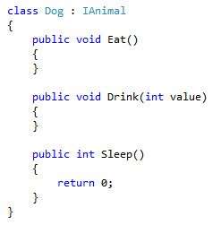
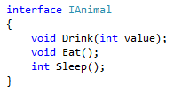
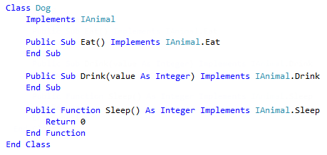

# Extract an interface refactoring

This refactoring applies to:

- C#

- Visual Basic

**What:** Lets you create an interface using existing members from a class, struct or interface.

**When:** You have several classes, structs or interfaces with methods that could be made common and used by other classes, structs or interfaces.

**Why:** Interfaces are great constructs for object-oriented designs. Imagine having classes for various animals (Dog, Cat, Bird) which might all have common methods, such as Eat, Drink, Sleep. Using an interface like IAnimal would allow Dog, Cat, and Bird to have a common "signature" for these methods.

## How-to

1. Highlight the name of the class to perform the action on, or just put the text cursor somewhere in the class name.

   - C#:

    

   - Visual Basic:

    

1. Next, do one of the following:

   - **Keyboard**
     - Press **Ctrl+R**, then **Ctrl+I**. (Note that your keyboard shortcut may be different based on which profile you've selected.)
     - Press **Ctrl+.** to trigger the **Quick Actions and Refactorings** menu and select **Extract Interface** from the Preview window popup.
   - **Mouse**
     - Select **Edit > Refactor > Extract Interface**.
     - Right-click the name of the class, select the **Quick Actions and Refactorings** menu and select **Extract Interface** from the Preview window popup.

1. In the **Extract Interface** dialog box that pops up, enter the information asked:

   

   | Field | Description |
   | --- | --- |
   | **New interface name** | The name of the interface to be created. This will default to I*ClassName*, where *ClassName* is the name of the class you selected above. |
   | **New file name** | The name of the file which will be generated that will contain the interface. As with the interface name, this will default to I*ClassName*, where *ClassName* is the name of the class you selected above. |
   | **Select public members to form interface** | The items to extract into the interface. You may select as many as you wish. |

1. Choose **OK**.

   The interface is created in the file of the name specified. Additionally, the class you selected implements that interface.

   - C#:

    
    

   - Visual Basic:

    
    

## See also

[Refactoring](../refactoring-in-visual-studio.md)