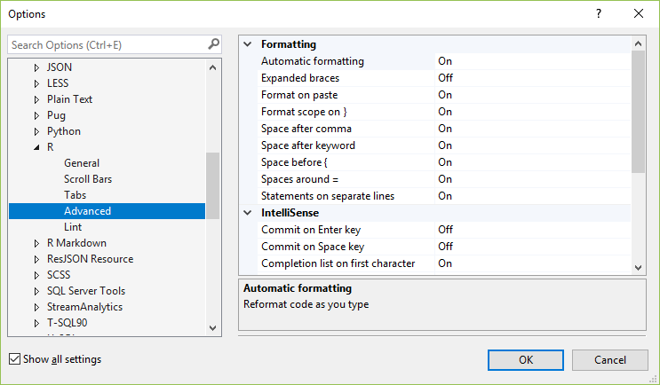
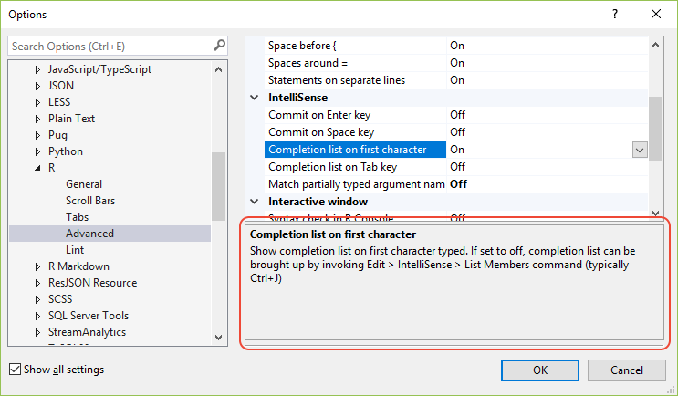

# R Tools for Visual Studio options

Settings are accessed through the **R Tools > Options** menu, or through **Tools > Options** and scrolling to **R Tools**:

  

Options and settings specific to R are accessed using the methods below. You must select the **Show all settings** box at the bottom of the **Options** dialog box for all of these sections to appear.

- Code formatting options (see [Editor options](editing-r-code-in-visual-studio.md#editor-options): **Tools > Options** menu, then select **Text Editor > R > Formatting**
- Linting options (see [Linting](linting-r-code.md)): **Tools > Options** menu, then select **Text Editor > R > Lint**
- Advanced editor options ([described in this article](#text-editor--r--advanced-options)): **Tools > Options** menu, then select **Text Editor > R > Advanced**
- Behavioral options ([described in this article](#r-tools--advanced-options)): **R Tools > Options** menu, or **Tools > Options**, then scroll to **R Tools**.

The **R Tools > Data Science Settings** command affects also a number of different settings in Visual Studio overall. This command is described in the next section.

## R Tools > Data Science Settings

The **R Tools > Data Science Settings** menu item configures the Visual Studio IDE with a layout that's optimized for the needs of data scientists. Specifically, this option opens the [Interactive](interactive-repl-for-r-in-visual-studio.md), [Variable Explorer](variable-explorer.md), and [Workspaces](r-workspaces-in-visual-studio.md) windows:

To revert to other Visual Studio settings later on, first use the **Tools > Import and Export Settings** command, select **Export selected environment settings**, and specify a file name. To restore those settings, use the same command and select **Import selected environment settings**. You can also use the same commands if you change the data scientist layout and want to return to it later on, rather than using the **Data Science Settings** command directly.

## Text Editor > R > Advanced options

These options control the behavior of formatting, IntelliSense, outlining, indenting, and syntax checking for R.

Each option is set to either on or off to control the behavior in question. For details on what each option affects, look at the help pane at the bottom of the dialog box. Note that you can drag the top of that help pane up to make the pane larger.

## R Tools > Advanced options

The **R Tools > Options** menu command opens the **Options** dialog to the R options:

  

The following sections describe the different options available on this page.

### Debugging

These options control how values are handled in [Variable Explorer](variable-explorer.md) and in debugger windows like Watch and Locals (see [Debugging](debugging-r-in-visual-studio.md)).

| Option | Default value | Description |
| --- | --- | --- |
| Evaluate active bindings | `True` | When `True`, ensures that you always see the most up-to-date value when inspecting variables and properties. The risk is that evaluating the expressions may cause side-effects, depending on how they were implemented. |
| Show dot-prefixed variables | `False` | Specifies whether variables prefixed with `.` are shown. |

### Grid view

| Option | Default value | Description |
| --- | --- | --- |
| Dynamic evaluation | `False` | By default, the `View(<expression>)` function takes a snapshot of data as a data frame, which can consume considerable memory with large data sets. Setting this option to `True` means that the expression is evaluated when the grid refreshes to fetch only that data that is displayed. However, if the expression changes the data also changes, which may be unsuitable for dplyr pip expressions. |

### Help

| Option | Default value | Description |
| --- | --- | --- |
| F1 Web browser | `Internal` | Controls how help is displayed when you are searching for a term using Ctrl+F1. When set to `Internal`, help is rendered within a tool window in Visual Studio. When set to `External`, help appears in your default web browser. |
| F1 Web Search String | `R site:stackoverflow.com` | Controls how search terms are passed to your search engine when you press Ctrl+F1 on a term in the editor. By default the string is `R site:stackoverflow.com`, which appends `R` to your search term. The `site:stackoverflow.com` is a directive to the search engine that tells it to scope the search to pages within the `stackoverflow.com` domain. |
| R Help Browser | `Automatic` | Controls how help is displayed when you are searching the R documentation using F1, `?`, or `??`. When set to `Automatic`, help renders in the appropriate window. For example, HTML help appears within a Visual Studio tool window, whereas PDFs appear in your default PDF program. When set to `External`, help is rendered in your default web browser. |

### History

| Option | Default value | Description |
| --- | --- | --- |
| Always save history | `True` | Controls whether RTVS writes your command history to a `.RHistory` file in your working directory whenever the project is closed. Saving the history happens even if you don't save your project before you exit. |
| Reset search filter | `True` | Determines whether the History window can filter your command history to show only the commands that substring match against the filter term in the R History dialog. This setting determines whether to reset your History search filter whenever you run a new command or switch to a new project, which triggers the load of a different `.RHistory` file. The default setting of `True` minimizes surprise when you run a command with a filter set, and you wonder why the command you just ran didn't show up in the History. |
| Use multiline selection | `True` | Specifies whether you can select a multi-line statement in History with a single click. Also enables up/down arrow navigation in the Interactive Windows by statements rather than lines. |

### HTML

| Option | Default value | Description |
| --- | --- | --- |
| HTML Pages browser | `External` | Determines where content such as a `ggvis` plot, or a `shiny` application is rendered. `Internal` shows HTML output within a tool window in Visual Studio; `External` displays HTML output in your default browser. |

### Logging

| Option | Default value | Description |
| --- | --- | --- |
| Log events | `Normal` | Controls the verbosity of the logging used for RTVS diagnostics. The default setting of `Normal` creates a log file in your `TEMP` directory. When set to `Traffic`, RTVS logs all commands, and responses in your session. These log files never leave your machine, but may be helpful for diagnosing problems in RTVS. |

### Markdown

| Option | Default value | Description |
| --- | --- | --- |
| Markdown preview browser | `External` | Determines where RMarkdown HTML output is displayed. `Internal` shows RMarkdown HTML document within a tool window in Visual Studio; `External` displays RMarkdown HTML using your default browser. |

### R Engine

| Option | Default value | Description |
| --- | --- | --- |
| Code page | `(OS Default)` | Sets the code page (locale) for R. By default it uses the underlying locale of the operating system. | 
| CRAN Mirror | `(Use .Rprofile)` | Sets the default CRAN mirror for package installations. The default setting of `Use .Rprofile` respects the CRAN Mirror settings in your `.RProfile` file. |

### Workspace

| Option | Default value | Description |
| --- | --- | --- |
| Load workspace when project opens | `No` | Setting to `Yes` enables loading of session data from the `.RData` file into the global environment when the project is opened. |
| Prompt to save workspace on reset | `Yes` | Setting to `No` disables prompting of saving your workspace when you click on the Reset button in the Interactive Window. |
| Save workspace when project closes | `No` | Setting to `Yes` enables saving the global environment to the `.RData` file when the project is closed. |
| Show confirmation dialog before switching workspaces | `Yes` | Setting to `No` disables prompting the user for confirmation when switching between different workspaces. See [switching between workspaces](r-workspaces-in-visual-studio.md#switching-between-workspaces) |
| Show machine load indicator | `False` | Controls visibility of the CPU/Memory/Network load indicator in the status bar. Because the indicator incurs network traffic, it's helpful to keep this `False` in remote metered scenarios. Changing this option requires that you restart Visual Studio. |
