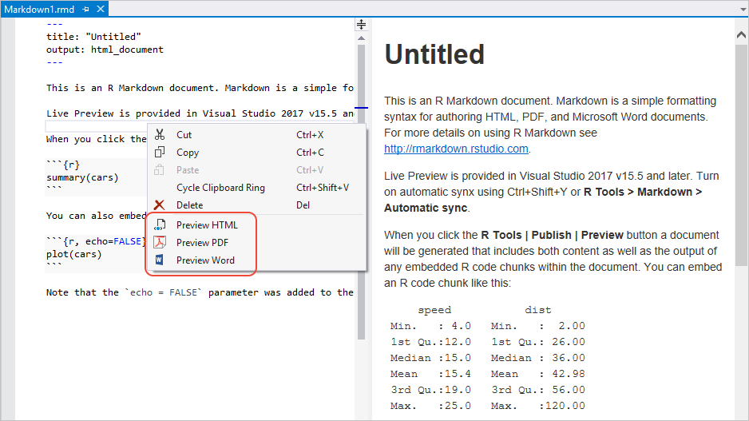

# Creating R Markdown documents

[R Markdown](https://rmarkdown.rstudio.com/) is a document format that turns analysis in R into high-quality documents, reports, presentations, and dashboards.

R Tools for Visual Studio (RTVS) provides a R Markdown item template, editor support (including IntelliSense for R code within the editor), file generation capabilities, and live preview.

## Using R Markdown

1. Close Visual Studio.
1. (One time only) Install `pandoc` from [pandoc.org](http://pandoc.org/installing.html).
1. Restart Visual Studio, which should pick up the pandoc installation.
1. Install the `knitr` and `rmarkdown` packages, which you can do from the [interactive window](interactive-repl.md):

    ```R
    install.packages("knitr")
    install.packages("rmarkdown")

    ```
1. Create a new R Markdown file using the **File > New > File** menu command and selecting **R > R Markdown** from the list. In the context of a project, right-click the project in Solution Explorer and select **Add R Markdown** (or **Add > New Item...** and selecting **R Markdown** from the list).

1. The default contents of the new file are as follows:

    ~~~markdown
    ---
    title: "Untitled"
    output: html_document
    ---

    This is an R Markdown document. Markdown is a simple formatting syntax for authoring HTML, PDF, and Microsoft Word documents. For more details on using R Markdown see <http://rmarkdown.rstudio.com>.

    When you click the **R Tools | Publish | Preview** button a document will be generated that includes both content as well as the output of any embedded R code chunks within the document. You can embed an R code chunk like this:

    ```{r}
    summary(cars)
    ```

    You can also embed plots, for example:

    ```{r, echo=FALSE}
    plot(cars)
    ```

    Note that the `echo = FALSE` parameter was added to the code chunk to prevent printing of the R code that generated the plot.

    ~~~

## Previews

Visual Studio 2017 version 15.5 and later automatically provide live preview for R Markdown. To turn on automatic sync between the editor and the preview, select **R Tools > Markdown > Automatic Sync** (Ctrl+Shift+Y). If you aren't using automatic sync, you can refresh the preview using **R Tools > Markdown > Reload R Markdown Preview**.

You can also preview the file in HTML, PDF, and Microsoft Word formats by right-clicking in the editor and selecting one of the **Preview** commands. The same commands are also available on the **R Tools > Markdown** menu. (In earlier versions of Visual Studio these commands are found on the **R Tools > Publish** menu.)


