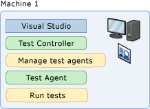
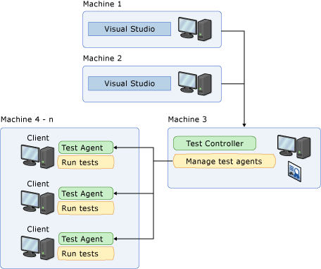
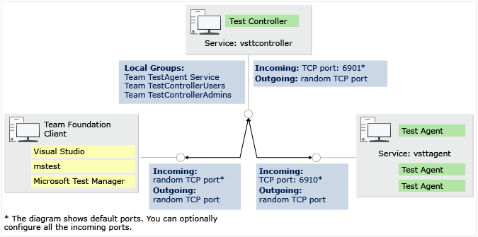

# Configure test agents and test controllers for running load tests

Visual Studio can generate simulated load for your app by using physical or virtual machines. These machines must be set up as a single test controller and one or more test agents. You can use the test controller and test agents to generate more load than a single computer can generate alone.

> [!NOTE]
> You can also use cloud-based load testing to provide virtual machines that generate the load of many users accessing your website at the same time. Learn more about cloud-based load testing at [Run load tests using Azure Test Plans](/azure/devops/test/load-test/get-started-simple-cloud-load-test?view=vsts).

[!INCLUDE [web-load-test-deprecated](includes/web-load-test-deprecated.md)]

## Load simulation architecture

The load simulation architecture consists of a Visual Studio client, test controller, and test agents.

-   The client is used to develop tests, run tests, and view test results.

-   The test controller is used to administer the test agents and collect test results.

-   The test agents are used to run the tests, and collect data including system information and ASP.NET profiling data defined in the test setting.

This architecture provides the following benefits:

- The ability to scale out load generation by adding additional test agents to a test controller.

- Flexibility for installing the client, test controller, and test agent software on the same or different computers. For example:

   **Local configuration:**

  - Machine1: Visual Studio, controller, agent.

    

    **Typical remote configuration:**

  - Machine1 and 2: Visual Studio (multiple testers can use the same controller).

  - Machine3: Controller (can have agents installed, too).

  - Machine4-n: Agent or agents all associated with the controller on Machine3.

    

Even though a test controller typically manages several test agents, an agent can only be associated with a single controller. Each test agent can be shared by a team of developers. This architecture makes it easy to increase the number of test agents, thereby generating larger loads.

## Test agent and test controller interaction

The test controller manages a set of test agents to run tests. The test controller communicates with test agents to start tests, stop tests, track test agent status, and collect test results.

### Test controller

The test controller provides a general architecture for running tests, and includes special features for running load tests. The test controller sends the load test to all test agents and waits until all the test agents have initialized the test. When all test agents are ready, the test controller sends a message to the test agents to start the test.

### Test agent

The test agent runs as a service that listens for requests from the test controller to start a new test. When the test agent receives a request, the test agent service starts a process on which to run the tests. Each test agent runs the same load test.

 Test agents are assigned a weight by the administrator, and load is distributed according to a test agent’s weighting. For example, if test agent 1 has a weighting of 30, and test agent 2 has a weighting of 70, and the load is set to 1000 users, then test agent 1 simulates 300 virtual users whereas test agent 2 simulates 700 virtual users. See [Manage test controllers and test agents with Visual Studio](../test/manage-test-controllers-and-test-agents.md).

 The test agent takes a set of tests and a set of simulation parameters as input. A key concept is that tests are independent of the computer where they're run.

## Test controller and test agent connection points

The following illustration shows the connection points between the test controller, the test agent, and the client. It outlines which ports are used for incoming and outgoing connections as well as security restrictions used on these ports.

 

 For more information see [Configure ports for test controllers and test agents](../test/configure-ports-for-test-controllers-and-test-agents.md).

## Test controller and agent installation information

For important information about hardware and software requirements for test controllers and test agents, the procedures for installing them, and configuring your environment for optimal performance, see [Install and configure test agents](../test/lab-management/install-configure-test-agents.md).

## Use the test controller and test agent with unit tests

After you have installed a test controller and one or more agents, you can specify whether to use a remote execution with the test controller in the test setting for your load tests. Additionally, you can specify the data and diagnostic adapters to use with the role that is associated with the agents in the test setting.

## See also

- [Install and configure test agents](../test/lab-management/install-configure-test-agents.md)