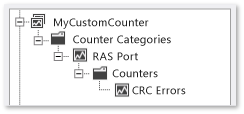

# How to: Add custom counter sets using the Load Test Editor

When you create a load test with the **New Load Test Wizard**, you add an initial set of counters. These offer you a set of predefined counter sets for your load test.

> [!NOTE]
> If your load tests are distributed across remote machines, controller and agent counters are mapped to the controller and agent counter sets. For more information on using remote machines in your load test, see [Test controllers and test agents](configure-test-agents-and-controllers-for-load-tests.md).

You manage your counters in the **Load Test Editor**. The counter sets that are already added to the test are visible in the **Counter Sets** node of the load test. After you create a Load test, you can add new custom counter sets to it.

[!INCLUDE [web-load-test-deprecated](includes/web-load-test-deprecated.md)]

## To add a custom counter set to a Load Test

1.  Open a load test.

2.  Expand the **Counter Sets** node. All the counter sets that have been added to the load test are visible.

3.  Right-click the **Counter Sets** node and select **Add Custom Counter Set**.

    > [!NOTE]
    > The counter set is given a default name, such as **Custom1**. You can change the name by using the **Properties** window. Press **F4** to display the **Properties** window.

4.  To add counters to your custom counter set, right-click the new counter set and then choose **Add Counters**. For more information about how to add counters, see [How to: Add counters to counter sets](../test/how-to-add-counters-to-counter-sets-using-the-load-test-editor.md).

    > [!NOTE]
    > It is also possible to add a custom counter set by right-clicking an existing counter set, choosing copy, and then pasting it to the counter sets node. Additional counters that are copied, but not needed, can be deleted. You can change the name of the new counter set by using the **Properties** window.

## See also

- [Specify the counter sets and threshold rules for computers in a load test](../test/specify-counter-sets-and-threshold-rules-for-load-testing.md)
- [Configure load test run settings](../test/configure-load-test-run-settings.md)